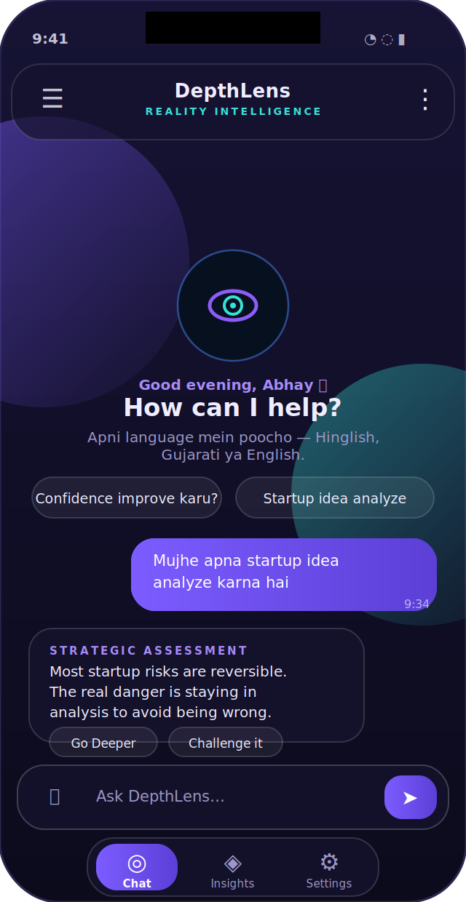
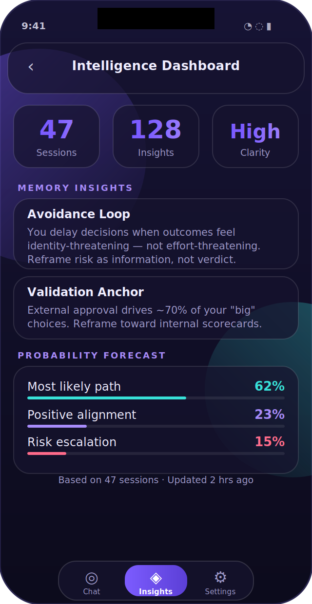
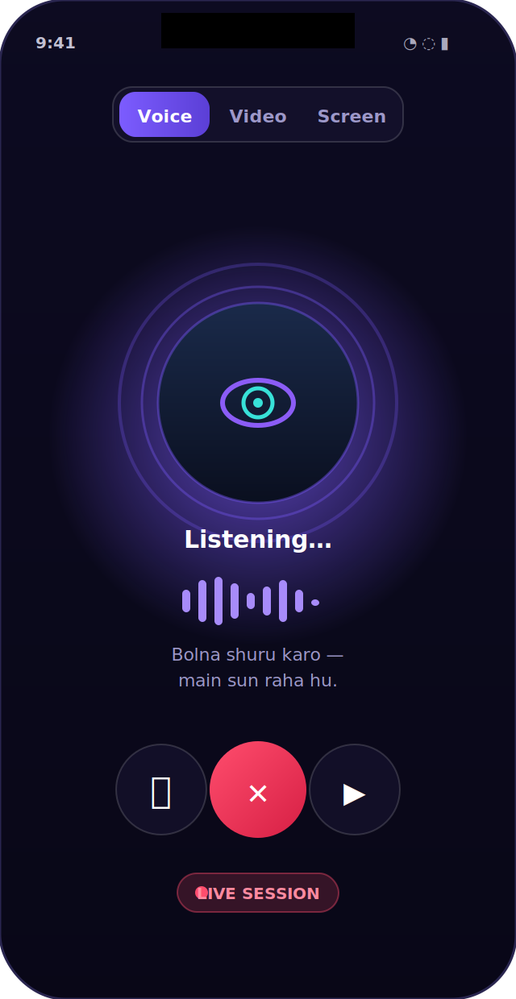
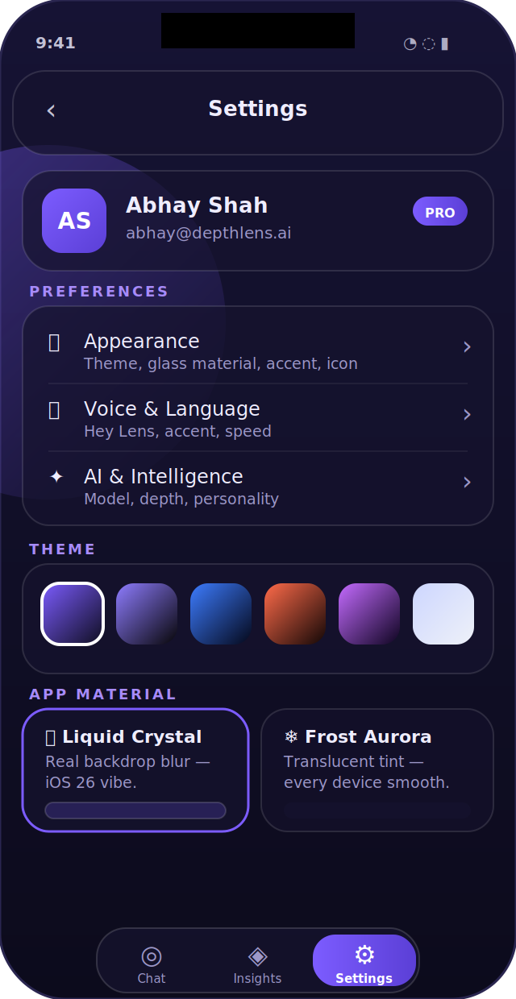

<div align="center">

<br/>

```
██████╗ ███████╗██████╗ ████████╗██╗  ██╗██╗     ███████╗███╗   ██╗███████╗
██╔══██╗██╔════╝██╔══██╗╚══██╔══╝██║  ██║██║     ██╔════╝████╗  ██║██╔════╝
██║  ██║█████╗  ██████╔╝   ██║   ███████║██║     █████╗  ██╔██╗ ██║███████╗
██║  ██║██╔══╝  ██╔═══╝    ██║   ██╔══██║██║     ██╔══╝  ██║╚██╗██║╚════██║
██████╔╝███████╗██║        ██║   ██║  ██║███████╗███████╗██║ ╚████║███████║
╚═════╝ ╚══════╝╚═╝        ╚═╝   ╚═╝  ╚═╝╚══════╝╚══════╝╚═╝  ╚═══╝╚══════╝
```

### **Reality Intelligence Platform**

*Most people see the surface. DepthLens reveals what lies beneath.*

[](https://github.com/madfordiamonds/DEPTHLENS/stargazers)

<br/>

<a href="https://github.com/trending">
  
</a>

<br/>

[](https://github.com/madfordiamonds/DEPTHLENS/releases)
[](https://kotlinlang.org)
[](https://developer.android.com/jetpack/compose)
[](https://firebase.google.com)
[](https://ai.google.dev)

<br/>

[**🌐 Live Website**](https://shorturl.at/TDOZi) &nbsp;·&nbsp; [**📱 Download APK**](https://github.com/madfordiamonds/DEPTHLENS/releases)

<br/>

<table><tr>
<td align="center"><br/><sub><b>Chat</b></sub></td>
<td align="center"><br/><sub><b>Insights</b></sub></td>
<td align="center"><br/><sub><b>Voice</b></sub></td>
<td align="center"><br/><sub><b>Settings</b></sub></td>
</tr></table>

</div>

---

<br/>

## The Problem with Ordinary AI

Most AI tools give you **answers**.  
DepthLens gives you **understanding**.

```
Traditional AI:   Question ──────────────────────► Answer

DepthLens:        Question ──► Analysis ──► Patterns ──► Root Causes ──► Understanding
```

The difference isn't speed. It's depth.

<br/>

---

## What Is DepthLens?

**DepthLens** is a Reality Intelligence Platform built for people who need to think clearly in complex situations.

It doesn't just respond — it investigates. It doesn't just inform — it reveals.

Whether you're navigating a business decision, understanding human behavior, analyzing a system, or exploring a pattern you can't quite name — DepthLens is built to go deeper than the surface.

<br/>

---

## Core Intelligence Modules

<br/>

### 🔍 Root Cause Analysis
Move past symptoms. Identify the true driver behind any problem, pattern, or situation.

### 🧠 Strategic Intelligence
Uncover hidden incentives, power structures, leverage points, and second-order effects before they catch you off guard.

### 👁️ Psychology & Human Behavior
Decode motives, decision-making patterns, emotional dynamics, and the invisible forces shaping behavior.

### 🔄 Systems Thinking
Map feedback loops, dependencies, unintended consequences, and complex interactions across any domain.

### 🔮 Future Probability Analysis
Explore possible outcomes, emerging risks, and high-probability scenarios before committing to action.

### 💬 Relationship Intelligence
Analyze communication patterns, conflicts, motivations, and interpersonal dynamics with precision.

### ⚖️ Decision X-Ray
Evaluate critical decisions from multiple perspectives — before you make them.

### 📚 Deep Research
Transform scattered, incomplete information into structured, actionable understanding.

<br/>

---

## Platform Features

| Feature | Status |
|---|---|
| Advanced Reality Intelligence Engine | ✅ Live |
| Multimodal Intelligence (Text, Image, File, PDF) | ✅ Live |
| Voice · Video · Screen Share Intelligence | ✅ Live |
| Hinglish / Gujarati / English auto-detect | ✅ Live |
| Long-Term Memory System | ✅ Live |
| Intelligence Dashboard (patterns + forecasts) | ✅ Live |
| Smart Conversation Titles | ✅ Live |
| Liquid Crystal & Frost Aurora glass themes | ✅ Live |
| 6 Themes + Accent Colors + App Icons | ✅ Live |
| "Hey Lens" hands-free wake word | ✅ Live |
| In-App Updates | ✅ Live |
| Background Analysis Notifications | ✅ Live |
| Biometric App Lock | ✅ Live |
| Incognito Session (no save) | ✅ Live |
| PDF Chat Export | ✅ Live |

<br/>

---

## Roadmap

> **Vision:** Build the world's most advanced Reality Intelligence System.

### 🧠 Smarter AI
Stronger foundation for everything DepthLens does.

- Smarter conversations with deeper contextual understanding
- Faster response times across all query types
- Better memory & multi-session context retention
- Ongoing UI refinements for a more fluid experience

### 🔭 Reality Intelligence
Moving from analysis to real-time situational awareness.

- Contextual Scenario Simulation — model outcomes before acting
- Adaptive Insight Generation — insights that evolve with you
- Real-Time Situation Awareness — understand what's happening now
- Cognitive Bias Detection — surface your own blind spots

### 🌐 Universal Intelligence
Connecting DepthLens to the world's live information.

- Real-Time Data Integration — markets, news, signals
- Knowledge Graph Expansion — structured understanding at scale
- Autonomous Research Capabilities — deep dives without prompting
- Context-Aware Recommendations — right insight, right moment

### 🎯 Personal Intelligence
A system that knows you and grows with you.

- Goal & Progress Tracking — measure what matters
- Personalized Insights — patterns unique to your mind
- Daily Intelligence Reports — your world, synthesized
- Long-Term Memory — context that compounds over time

<br/>

---

## Privacy by Design

Your conversations are **yours** — not ours.

DepthLens is built around one principle: a tool this powerful should serve the user, not harvest them.

- **User-controlled memory** — export, delete, or disable at any time
- **Incognito sessions** — conversations that leave no trace
- **Data isolation** — no user can ever access another's information
- **Biometric lock** — fingerprint / face lock the app
- **Auto cleanup** — files auto-delete after sessions
- **No surveillance defaults** — nothing shared without explicit action

<br/>

---

## Tech Stack

```
Language          Kotlin
UI Framework      Jetpack Compose
Architecture      MVVM + Clean Architecture
AI Engine         Google Gemini (Flash · Pro · Lite — auto-selected)
Live AI           Gemini Live WebSocket API (Voice/Video/Screen)
Backend           Firebase (Auth, Firestore, Storage)
Local DB          Room
Async             Kotlin Coroutines + Flow
```

<br/>

---

## Intelligence Philosophy

> *Information is available everywhere. Understanding is rare.*

DepthLens is designed around a single conviction: most people are drowning in information and starving for clarity.

The platform is built to move users from:

**Information → Insight → Understanding → Better Decisions → Better Outcomes**

Not as a tagline. As an architecture.

<br/>

---

## Download

[](https://github.com/madfordiamonds/DEPTHLENS/releases)

> Requires Android 8.0 (API 26) or higher.

<br/>

---

## Contributing

DepthLens is actively evolving.

Feedback, bug reports, feature suggestions, and edge-case discoveries are always welcome. If you see something that doesn't match the depth this platform is supposed to deliver — say so.

Open an issue. Start a discussion. Help shape what Reality Intelligence becomes.

<br/>

---

<div align="center">

### DEPTHLENS

**SEE BEYOND THE SURFACE**

*Most people see symptoms. DepthLens reveals patterns.*  
*Most people see events. DepthLens reveals systems.*  
*Most people see answers. DepthLens reveals reality.*

<br/>

[Website](https://shorturl.at/TDOZi) · [Download](https://github.com/madfordiamonds/DEPTHLENS/releases) · [Issues](https://github.com/madfordiamonds/DEPTHLENS/issues)

<br/>

*Made with* 👁️ *· © 2026 DepthLens*

</div>